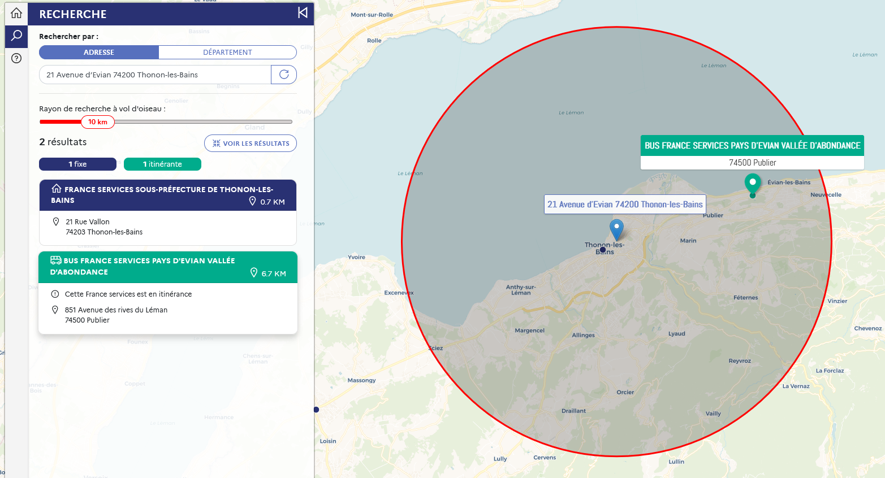

## Annuaire cartographique France services

Page officielle : https://france-services.gouv.fr

Lien direct : https://anct-carto.github.io/france_services

## Présentation

L'annuaire cartographique France services permet aux usagers de trouver, pour une adresse donnée, les structures les plus proches de chez eux et d'affiner les résultats selon une distance de recherche. Une recherche par département est également proposée pour permettre de connaitre l'ensemble des France services présentes au sein d'un département donné. 

## Fonctionnalités 

- Trouver les France services les plus proches d’une adresse selon une distance de recherche ;
- consulter la liste des France services ouvertes par département ;
- partager les résultats d’une recherche ;
- consulter, partager et télécharger dans une fiche pdf les informations relatives à une structure : localisation, contacts, horaires d’ouverture, circuit d’itinérance si bus … etc.

## Données
Les données diffusées par cette carte sont collectées, traitées et maintenues à jour de manière régulière, conjointement par l'ANCT et la Banque des Territoires, sur la base des informations renseignées par préfectures de départements ainsi que les agents présents au sein même des Frances services. 

Les données sont diffusées sous licence Ouverte Étalab 2.0 sur la page data-gouv de l'ANCT : https://www.data.gouv.fr/fr/datasets/liste-des-structures-france-services/ 

## Technologies

Cet outil a été développé par le service cartographie de l'ANCT. Il est écrit en HTML/CSS/Javascript et utilise les librairies : Vue 2.7 ; Leaflet 1.0.7 et son extension communautaire Leaflet Sidebar ; Turf ; Bootstrap 4 ; Line-awesome ; jsPDF, Papaparse. 
Le moteur de recherche s'appuie sur l'API adresse (alimentée par la Base adresse nationale) et sur l'API Découpage Administratif. 

## En savoir plus sur le programme

Sur le site du ministère de la Transition écologique et de la Cohésion des territoires : https://ecologie.gouv.fr/france-services

Sur le site de ANCT : https://agence-cohesion-territoires.gouv.fr/france-services-36
